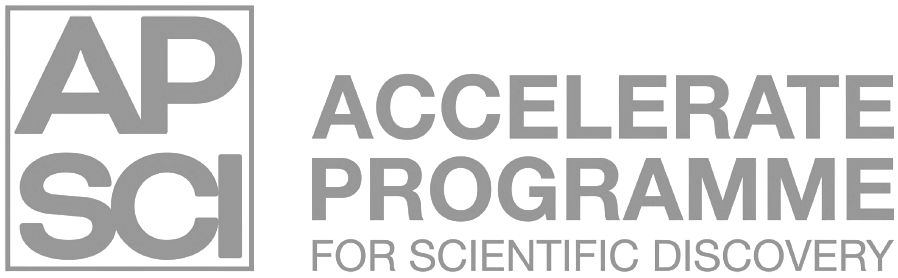
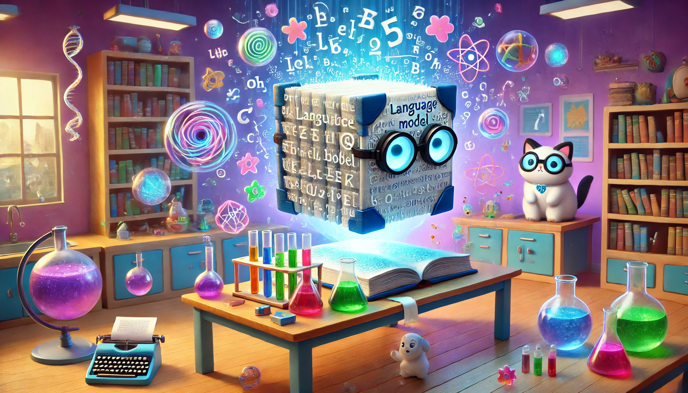
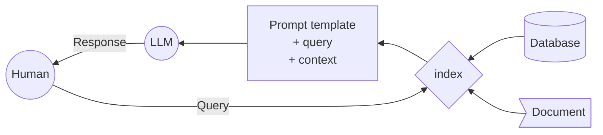

# LLM Hands on Workshop

<!--  -->

### Welcome to the material for the LLM Hands on Workshop!

There is a wealth of material online about how to use and work with LLMs. So much so that it can hard to know where to start, and what path to take to get from beginner to proficient. Therefore, we have created this workshop by combining the best bits of many different resources, and focusing on practical skills that you can use to work with LLMs.

## A focus on retrieval augmented generation

This workshop places the focus on retrieval augmented generation (RAG). The general RAG process looks something like the below:

We are used to interacting with user interfaces like ChatGPT, and not always aware of the infrastructure underneath. In short, RAG involves taking some data from a document or database and creating an index - a database that allows us to quickly search over chunks of our documents. When a user sends input to the model interface, this database is queried and the relevant search results are returned, similar to when you Google something, you get a list of potential websites to check. These relevant chunks are then sent to a LLM, along with your original input, and the LLM generates a response.

Sounds easy?

Well yes - and no! While it is fairly easy to get up and running with RAG, it is actually quite hard to get it working correctly and consistently.

We try to focus on a framework agnostic approach, so that you can use models from any provider, or run local models if you like. Instead of relying on popular but complex frameworks like LangChain or LlamaIndex, we've chosen to focus on fundamental tools:

- Direct API interactions using OpenAI
- Data validation using Pydantic
- Jinja templates for prompt engineering
- ChromaDB for indexing
- Streamlit for user interfaces

By building from the ground up, this workshop aims to provide researchers and practitioners with:

- A deep understanding of core LLM concepts and workflows
- The ability to create custom, flexible solutions
- Enhanced debugging and problem-solving skills
- A solid foundation for evaluating and using higher-level frameworks in the future, if desired

While frameworks certainly have their place in rapid prototyping and production environments, we believe that starting with the basics offers long-term benefits, and transferrable skills that apply across different models and providers.

This workshop doesn't aim to dismiss the value of existing frameworks. Instead, it empowers you with the knowledge to better understand, evaluate, and leverage these tools when appropriate, while also giving you the confidence to build custom solutions when needed.
By the end of this workshop, you'll have a robust, foundational understanding of LLMs that will serve you well in research, development, and practical applications, positioning you to drive innovation in this exciting field.

## How to use this workshop

This site is pretty simple, start with [Setting up](https://docs.science.ai.cam.ac.uk/large-language-models/setting-up/overview/) and then continue through the sections in order. We start with some basic API calls, then introduce more features until we have a fully working chat application.

The main outcome of this workshop is to have you conversing with an LLM about your own research or data.

You can work through the workshop in order... or you can just pick a section that interests you.

<!-- 

-   :material-cogs:{ .lg .middle } [__Setting up__](1_setting_up.md)

    ---
    Setting up your GitHub repo and Codespace

-   :fontawesome-solid-book:{ .lg .middle } [__Project overview__](2_project_overview.md)

    ---
    An overview of the project - moving from Jupyter Notebooks to python scripts

-   :material-feather:{ .lg .middle } [__Poetry__](3_poetry.md)

    ---
    An introduction to the power of Poetry

-   :fontawesome-solid-flask:{ .lg .middle } [__Testing__](4_Testing.md)

    ---
    How to test your package

-   :fontawesome-solid-cubes:{ .lg .middle } [__Publishing__](publishing_docs/publishing.md)

    ---
    Publishing to PyPI and making documentation with MkDocs

-   :octicons-git-branch-24:{ .lg .middle } [__CI/CD__](CICD/index.md)

    ---
    How to automate the everything!

-   :fontawesome-solid-person-chalkboard:{ .lg .middle } [__Slides__](resources/slides.md)

    ---
    Here you can find the slides for the course material

-   :fontawesome-solid-paperclip:{ .lg .middle } [__Resources__](resources/references.md)

    ---
    Each section contains a summary of further resources, but here they are all collected for convenience

 -->