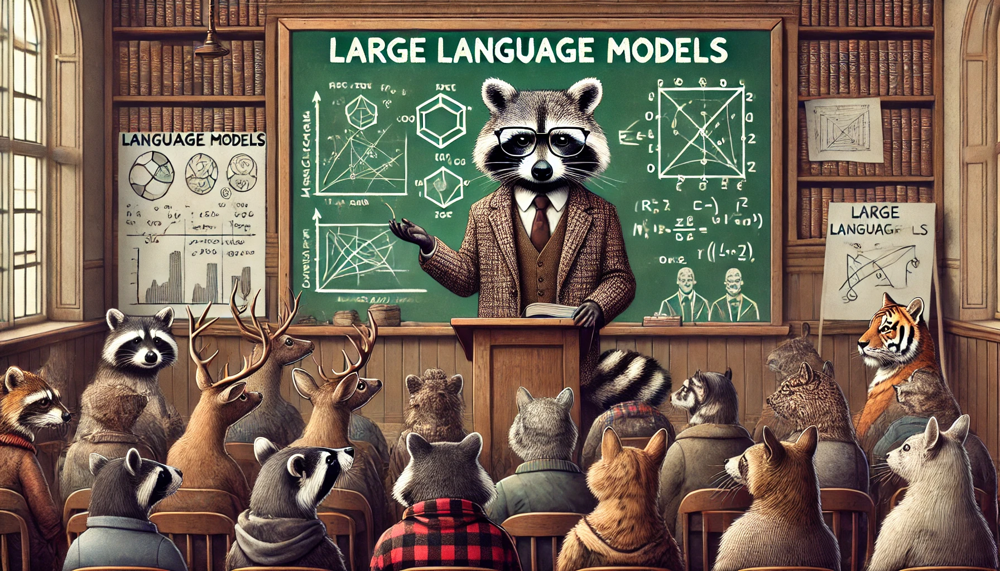

# Introduction to Large Language Models

Welcome to the Introduction to Large Language Models workshop offered by the Accelerate Programme for Scientific Discovery. In this workshop, we will get situated in the chaotic and fast-moving world of LLMs!

This workshop was originally delivered in-person at the University of Cambridge, but we have made the slides and some of the material available here for you to work through at your own pace.
