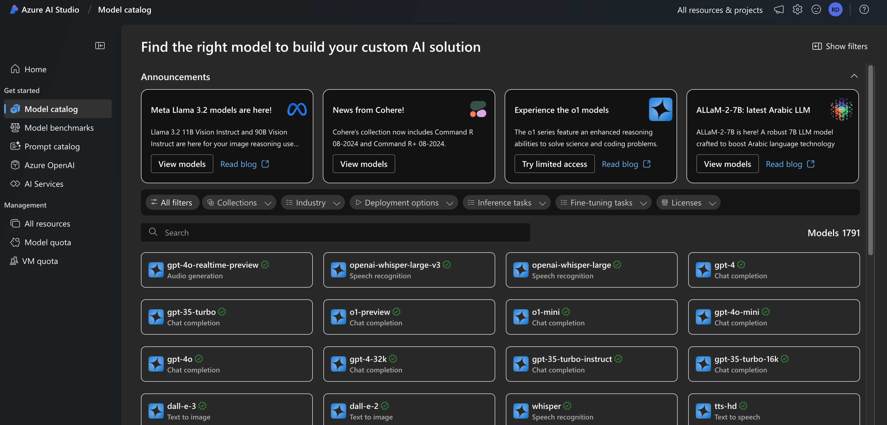
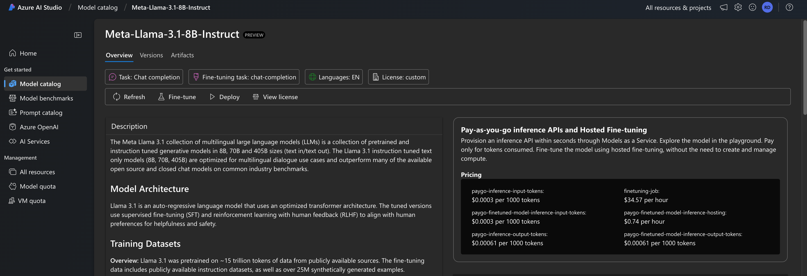
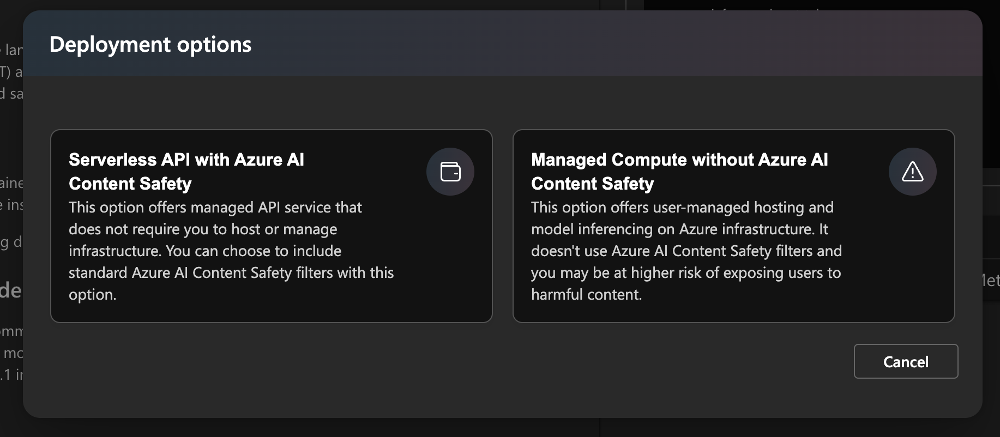

# Azure AI Studio

There are currently 3 major model as a service (MaaS) providers (there are probably more, but these are currently the main ones):

- **Amazon** AWS Bedrock
- **Google** GCP Vertex AI
- **Microsoft** Azure AI Studio

Everyone will have a different opinion on which one is best, and which offers the best services. But essentially: they are all the same! They all have a learning curve; they all have roughly similar pricing structures; they all offer similar online courses; they are all annoying in some way.

Here, we focus on Microsoft Azure AI Studio. The main advantages of Azure are:

- The easy use of the OpenAI API rather than a custom one (as is the case for AWS and GCP);
- The ease of deploying serverless endpoints;
- The range of models (including OpenAI models).

The rabbithole for cloud services is dark (and potentially full of deranged) rabbits, so we will not go into significant details, instead focusing on getting up and running with AI Studio, and deploying an endpoint. If you want to learn more about Azure services in general, they have an accessible [introductory course](https://learn.microsoft.com/en-us/collections/n6ga8m0jkgrwk).

## 1. Sign up
You will need to [sign up for an Azure account](https://azure.microsoft.com/en-gb/pricing/purchase-options/azure-account) and you will need to register a payment method. Most cloud providers will give you a free trial for a limited amount of time and/or credits.

## 2. Login to AI Studio
Once you've signed up to Azure, you can login to AI Studio, and browse the model catalogue, which should look something like this:



## 3. Deploy as a serverless API
When you deploy a model to an endpoint, you will be able to query it as you would an OpenAI model. Select a model (in the example below it is `Llama-3.1-8B-Instruct`), and hit deploy.



You will have 2 deployment options:



For now, hit the serverless API option. If this is your first time, you will have to create a new project and a new hub. You will then be given the option of adding or creating a new subscription, resource, group, and AI Service. This is an Azure-backed service, so storage and a key vault will also be created for you.

Once everything is set up, you can "Subscribe and Deploy". You will now be given a Deployment name, and the option to disable content filtering (content filtering is a billed service). AI studio will now create an endpoint that you can send requests to using the OpenAI API.

## 4. Consume
To consume your services, you will need to add two things to you `.env` file:

```bash
AZURE_API_KEY="your-api-key"
AZURE_URL="https://<name-of-model>.<region>.models.ai.azure.com/v1/"
```

The Url can be found on the Deployments page. You then initialize the OpenAI API client:

```python
dotenv.load_dotenv()

client = OpenAI(
    base_url=os.getenv("AZURE_URL"),
    api_key=os.getenv("AZURE_API_KEY")
)

completion = client.chat.completions.create(
    model="azureai",
    messages=messages
)
```

And that's it!

## 5. Delete
To delete your endpoint, you need to hit "Delete" in the deployment page in AI Studio, and you may want to delete other resources allocated in the Azure Dashboard as well.