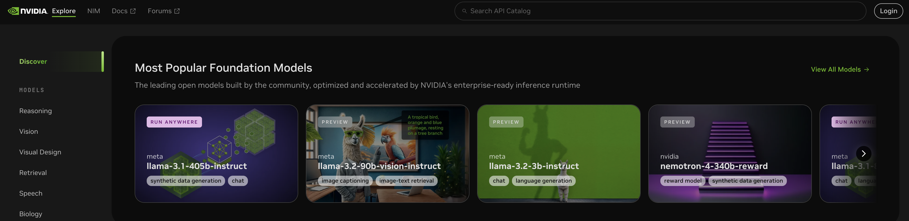
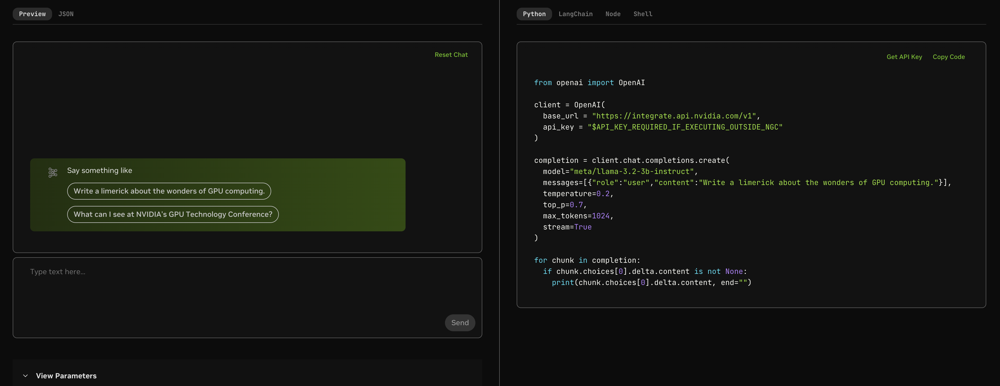

# Nvidia NIMS

For rapid prototpying, NVIDIA NIM inference microservices are a very good entry point to playing with LLMs. Two big advantages of the Nvidia models is that they are free, and they have a wide range of models available.

Setting up an account is simple. Head to the [Nvidia Build](https://build.nvidia.com/explore/discover) website and sign up. If you use a personal account, you will get 1,000 free requests, and if you use a business account (or sign up for an enterprise trial, you will get 5,000 free requests).

You can now select from a broad range of models. Below is an example of the `meta/llama-3.2-3b-instruct` model. You can either play around with it in the Playground. Or you can use it as you would an OpenAI model.

Select `Get API Key` in the top right of the Python example, and you can get 24 hour access to the model. Once the 24 hours is up, you can always renew the key.