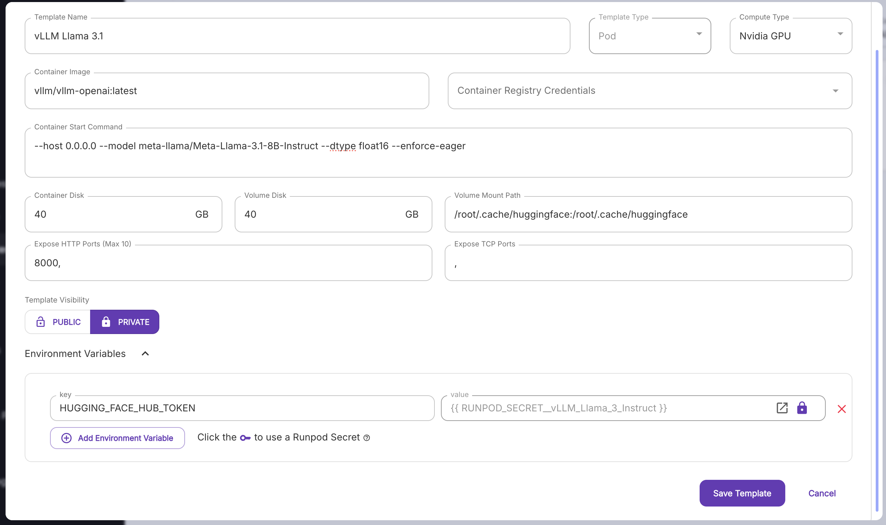
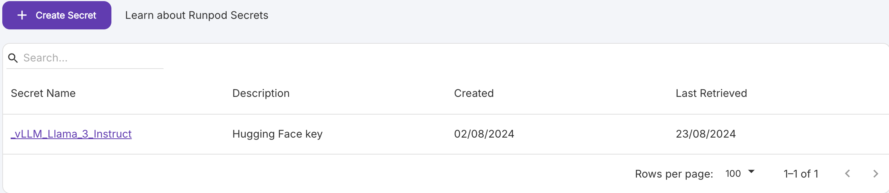
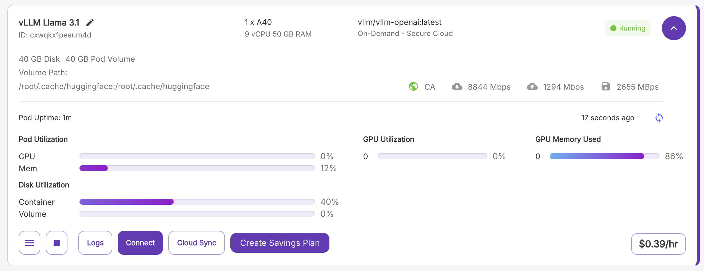

# Runpod

For this demonstration we will run `llama-3.1-8b` on a Nvidia A40 GPU. If you want to do this, you will need to set up a RunPod account, add a payment method, and deposit some credit. For RunPod, you pay by the hour.

## Setup Runpod and Hugging Face access
**1. Create a RunPod account** Head to the [runpod website](https://www.runpod.io/) and create an account.

**2. Over to `Billing` and add some credit** You can add a payment method and deposit any amount you like.

**3. Gain access to Llama 3.1** You will need to request access to the Llama 3.1 models. You can do this by heading over to the [Hugging Face site](https://huggingface.co/meta-llama/Meta-Llama-3.1-8B). You'll need to log in and request access. It's usually pretty quick, but it can take a day or two.

**4. Create a RunPod Template** Head to templates and add a new template. Fill out the details as shown below.



For the token you'll need to add a new Hugging Face API token. You can create one [here](https://huggingface.co/settings/tokens).



**5. Create a Pod** Once your template has been set, you can create a Pod. Head to `Pods` and click `+ Deploy`. Select the Nvidia A40 and the Llama 3.1 template you created earlier. The pod will take a while to to start up, but when it does you should see something like the below image



Hit `Connect` and then `Connect to HTTP Service [Port 8000]`. You will be directed to a confusing looking page that just says `{"detail":"Not Found"}`. Don't worry, this is normal. Copy the URL that is in the browser bar. This is your API endpoint.

## Connect to your API endpoint

Now we can connect to our API endpoint. Fire up a Jupyter notebook, and try running the following, pasting in the URL you copied earlier.

```python
from openai import OpenAI

model = "meta-llama/Meta-Llama-3.1-8B-Instruct"
base_url = <ENTER YOUR URL HERE>

openai_api_key = "EMPTY"
openai_api_base = base_url + "v1"
client = OpenAI(
    api_key=openai_api_key,
    base_url=openai_api_base,
)
```

This sets up the client.

```python

system_prompt_base = "You are a helpful assistant."

completion = client.chat.completions.create(
    model=model,
    messages= [
            {"role": "system", "content": system_prompt_base},
            {"role": "user", "content": "Hello, how are you?"}
        ],
    max_tokens=256,
    stream=True,
    temperature=0.6,
    stop="<|eot_id|>"
)

# completion.choices[0].message.content

for chunk in completion:
    if chunk.choices[0].delta.content is not None:
        print(chunk.choices[0].delta.content, end="")
```

If you switch back to the RunPod terminal, you should see some activity showing throughput (the number of tokens per second).

If you get any errors, the RunPod terminal is the best place to see what went wrong.

You can switch out Llama 3.1 for any of the other [models supported by vLLM](https://docs.vllm.ai/en/latest/models/supported_models.html). Please note that not all of these models will have the same level of support. You might also find subtle differences. For example: the MistralAI models do not have an explicit system prompt; and some models have different context window limits that you may need to set manually in the RunPod template. If you are having trouble with a particular model, please feel free to ask for help.

## MaaS or Self-service?
That is the question. Do you use a MaaS service like Azure AI Studio, or run your own cloud instance? There are advantages and disadvantages to both.

- Self-service means greater control, but costs will be higher.
- You'll be able to run your own models freely, and hosting finetuned models will be the same cost as hosting the base model.
- There is a learning curve, but not significantly more than getting a MaaS up and running

There will be a certain point where the cost to run a MaaS will outpace that of self-serving. Let's look at an example:

- The current price for 4x A40 GPUs is $1.56/hr.
- The current prices for Meta-Llama-3.1-70B-Instruct on Azure AI Studio:
    - Input:  $0.00268/1000 tokens
    - Output: $0.00354/1000 tokens

The question now is: at what point does it become more cost effective for me to use a RunPod instance?

Assuming an even amount of input and output tokens, it means you would need approximately 250k tokens **each** for input and output to get to the $1.56 cost in one hour. That's ~360k words. As a reference, the first 3 Harry Potter books combined are about 250K words.

That's ~140 tokens per second. Can the A40s even achieve that kind of throughput...?