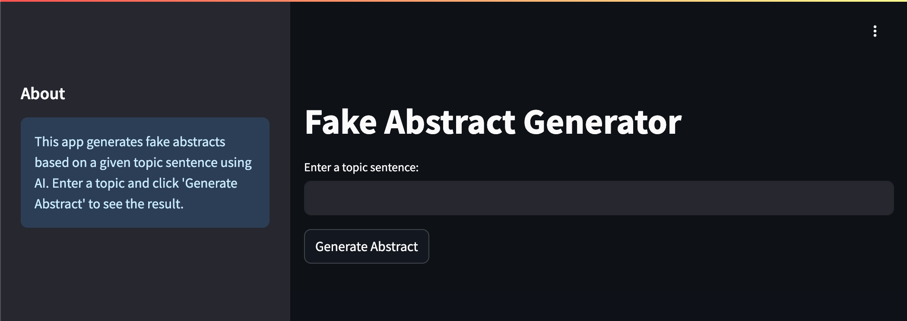

# Introduction to Streamlit
Building nice looking front-end systems is _**hard**_. And it's not something that we really want to spend a lot of time doing. Fortunately, some very smart people have spent a lot of time and effort to make this process easier for us, and developed some frameworks.

Streamlit is a fast and lightweight framework to develop proof of concept applications without having to deep dive into libraries like Django or Flask.

Streamlit is usually run from the command line using

```bash
streamlit run my_app.py [-- any arguments]
```

or

```bash
python -m streamlit run my_app.py
```

This means that we can't run things in a jupyter notebook, and will have to use `.py` files. But that's OK, because that's really where we should be doing most of our developing anyway.

Streamlit has an extensive documentation library that can help you develop specific applications. During this section, we will set out with a goal in mind, and just address things as they come up. Our goal for this section is to develop an application that when we input some topic sentence, an abstract is given to us. We will then see what basic customization we can do.

## First steps
In the first go, we will just focus on showing the abstract on the screen.

### Getting started

First, we need to create a new folder in our root directory called `abstract-application`. We then add a new file called `app.py`.

We have a bunch of code that we can reuse from the prompting exercise we did earlier. We can also copy over the prompt templates. So copy over the `system.jinja` and `user.jinja` files from the `prompt` folder we used in the **Prompting** section.

From here on, you can follow along in order, adding the code to you application.

### Imports
We need the following imports:

```python
import streamlit as st
from openai import OpenAI
from jinja2 import Environment, FileSystemLoader, select_autoescape, TemplateNotFound
from typing import Any
import os
import dotenv
```

and we also need to load the environment variables

```python
dotenv.load_dotenv()
```

### Functions from the **Prompting** section
We can just copy over the previous functions:

```python title="Generate the chat response"
def chat_response(system_prompt : str, user_prompt : str, model : str, temperature : float) -> str:
    client = OpenAI()

    response = client.chat.completions.create(
        model=model,
        messages=[
            {"role": "system", "content": system_prompt},
            {"role": "user", "content": user_prompt}
        ],
        temperature=temperature,
        max_tokens=400
    ).choices[0].message.content

    return response
```

```python title="Generate the abstract"
def generate_abstract(topic : str) -> str:
    generation_system_prompt = load_template("./prompts/system.jinja", {})
    generation_user_prompt = load_template(
        "./prompts/user.jinja",
        {
            "topic": topic,
        }
    )

    fake_abstract = chat_response(generation_system_prompt, generation_user_prompt, "gpt-4o-mini", 0.2)

    return fake_abstract
```

### Template Loading
We also use the same template loading function, but with some minor changes. Firstly, it's good to just add some error handling, and also we need to tell Jinja where to look. This will be required for running the application in Codespaces.

```python title="Get the template"
def load_template(template_filepath: str, arguments: dict[str, Any]) -> str:
    try:
        # Get the directory of the current script
        current_dir = os.path.dirname(os.path.abspath(__file__)) # (1)!
        # Set up the Jinja environment with the correct base path
        env = Environment(
            loader=FileSystemLoader(searchpath=current_dir),
            autoescape=select_autoescape()
        )
        template = env.get_template(template_filepath)
        return template.render(**arguments)

    except TemplateNotFound:
        st.error(f"Template file not found: {template_filepath}")
        return None
```

1.  This is the only difference. We essentially have to find the absolute path of the current directory that the application is running in, so we can then find the path of the jinja template _relative_ to that path.

### The Streamlit components
Now we start actually adding the streamlit parts, and it's actually really simple. Streamlit has a number of predefined building blocks for us to use, also called _widgets_.

The first two are the `title` and `text_input` widgets.

```python title="Title and input"
# Streamlit app
st.title("Fake Abstract Generator")

# User input
topic = st.text_input("Enter a topic sentence:")
```
The title and a text input field will appear at the top of the page. The `text_input` widget will be a single line, but if you want a commonly used "short answer" style text box, then you can use `text_area`. They do the same thing; the only difference is aesthetics.

The next widget is a `button`. In Streamlit, whenever something is interacted with on the screen, your script is run again. This is essentially what we want - everytime someone presses the button, we want to grab the input text and generate the abstract.

```python title="Button"
# Generate button
if st.button("Generate Abstract"):
    if topic:
        with st.spinner("Generating abstract..."):
            abstract = generate_abstract(topic)
        st.subheader("Generated Abstract:")
        st.write(abstract)
    else:
        st.warning("Please enter a topic sentence.")
```

What you can nest inside the button:
- Transient messages that immediately disappear.
- Once-per-click processes that saves data to session state, a file, or a database.

What you should not nest inside a button:
- Displayed items that should persist as the user continues.
- Other widgets which cause the script to rerun when used.
- Processes that neither modify session state nor write to a file/database, expect when producing disposable results (which we essentially are).

#### Session States
If we want to maintain the button state while we are interacting with other things, we have to use something called `session_state`. This will persist states across runs. We will use this later...but not now...

If what you want is like a toggle switch, then there is a `checkbox`.

Finally, we add a `sidebar`. These things are pretty important, and can be used to manage multipage applications, and store information about your session. They are also commonly where you can put controls like sliders and checkboxes.

```python title="Extra decoration"
# Add some information about the app
st.sidebar.header("About")
st.sidebar.info(
    "This app generates fake abstracts based on a given topic sentence using AI. "
    "Enter a topic and click 'Generate Abstract' to see the result."
)
```

We can run this by typing in the terminal:

```bash
streamlit run abstract-application/app.py
```

You should see something that looks like the image below



Enter some text in the text bar and the application will generate some text and display it on screen.

## Customization
We will start with some basic things, like changing the temperature or the model type, then add some functionality like the ability to display tokens used, and the price.

### Temperature and model
We will add a dropdown box and slider to select the model and the temperature. This is pretty easy, and we just need to add the following:

```python
# Sidebar controls
st.sidebar.header("Settings")
temperature = st.sidebar.slider("Temperature", min_value=0.0, max_value=2.0, value=0.2, step=0.01)
model = st.sidebar.selectbox("Model", ["gpt-4o-mini", "gpt-4o"])
```

We cap out the temperature at `2.0` because OpenAI won't let us set the temperature any higher - you'll get a `Error code: 400` if you try. Don't worry though, anything above `1.2` is usually unhinged.

We also need to modify the `generate_abstract` function so that it can take the `model` and `temperature` as arguments. If you run this, notice that if you change the temperature or model, the script will rerun, and you'll lose the abstract. You can just add the functionality to save the abstracts to a directory if you want.

I don't like the fact that `app.py` appears in the brower tab. To rename it, at the top of the `app.py` file, before the first function, write the following:

```python
st.set_page_config(page_title="Abstractinator")
```

### Tracking tokens and spending
We need to keep track of tokens and costs across multiple generations. This means we need to use the `session_state` functionality. Before doing this, we will just import the libraries that we need:


```python
import yaml
import json
```

We should define these things first in the script, and we want to keep track of sent and received tokens:

```python
# Initialize session state
if 'total_tokens' not in st.session_state:
    st.session_state.total_tokens = 0
if 'total_cost' not in st.session_state:
    st.session_state.total_cost = 0
if 'sent_tokens' not in st.session_state:
    st.session_state.sent_tokens = 0
if 'sent_cost' not in st.session_state:
    st.session_state.sent_cost = 0
if 'received_tokens' not in st.session_state:
    st.session_state.received_tokens = 0
if 'received_cost' not in st.session_state: 
    st.session_state.received_cost = 0
```

Next, we might want to define a _config_ file. This file is responsible for defining various configuration parameters for our application:

```yaml
costs:
  gpt-4o-mini:
    input: 0.00015
    output: 0.0006
  gpt-4o:
    input: 0.0025
    output: 0.01
```

!!! note

    These costs are per 1,000 tokens and are accurate from October, 2024. To check up to date costs, please visit the [OpenAI Pricing](https://openai.com/api/pricing/) page.


This will allow us to define these configuration parameters externally. We now need to load this config file into the session state:

```python
# add config yaml to session_state
if 'config' not in st.session_state:
    current_dir = os.path.dirname(os.path.abspath(__file__))
    with open(os.path.join(current_dir, "config.yml"), "r") as config_file:
        config = yaml.safe_load(config_file)
    st.session_state.config = config
```

We add a new function to update usage statistics:

```python
def update_usage_statistics(tokens, model):
    st.sidebar.header("Usage Statistics")
    st.sidebar.metric("Total Tokens Sent", f"{st.session_state.sent_tokens:,}")
    st.sidebar.metric("Total Tokens Received", f"{st.session_state.received_tokens:,}")
    st.sidebar.metric("Total Tokens Used", f"{st.session_state.total_tokens:,}")
    st.sidebar.metric("Total Cost ($)", f"{st. session_state.total_cost:.6f}")

    with open("session_state.json", "w") as f:
        json.dump(st.session_state, f)
```

and a function to calculate costs:

```python
def update_costs(tokens, model):
    sent_tokens = tokens.prompt_tokens
    received_tokens = tokens.completion_tokens
    total_tokens = sent_tokens + received_tokens
    
    sent_cost = sent_tokens * st.session_state.config["costs"][model]['input'] / 1000
    received_cost = received_tokens * st.session_state.config["costs"][model]['output'] / 1000
    total_cost = sent_cost + received_cost / 1000

    st.session_state.total_tokens += total_tokens
    st.session_state.total_cost += total_cost
    st.session_state.sent_tokens += sent_tokens
    st.session_state.sent_cost += sent_cost
    st.session_state.received_tokens += received_tokens
    st.session_state.received_cost += received_cost
```

We need to adjust the `generate_abstract` and `chat_reponse` functions to return the content _as well as_ the tokens. Here are the updated functions:

```python
def chat_response(system_prompt : str, user_prompt : str, model : str, temperature : float) -> str:
    client = OpenAI()

    response = client.chat.completions.create(
        model=model,
        messages=[
            {"role": "system", "content": system_prompt},
            {"role": "user", "content": user_prompt}
        ],
        temperature=temperature,
        max_tokens=400
    )

    content = response.choices[0].message.content
    tokens = response.usage

    return content, tokens


def generate_abstract(topic, model, temperature):
    generation_system_prompt = load_template("./prompts/system.jinja", {})
    generation_user_prompt = load_template(
        "./prompts/user.jinja",
        {
            "topic": topic,
        }
    )

    fake_abstract, tokens = chat_response(generation_system_prompt, generation_user_prompt, model, temperature)

    return fake_abstract, tokens
```

Finally we add two new lines. One below the call to `generate_abstract(topic, model, temperature)`:

```python
update_costs(tokens, model)
```

and on the final line:

```python
update_usage_statistics()
```

Your overall page should look something like this:


## Final thoughts
This is just a starting point for Streamlit - there are very many customization options available. A good next step from here if you want to test your skills is to build a fully functioning chat model using the lessons learned here, and using the lessons from the States and Storage sections.